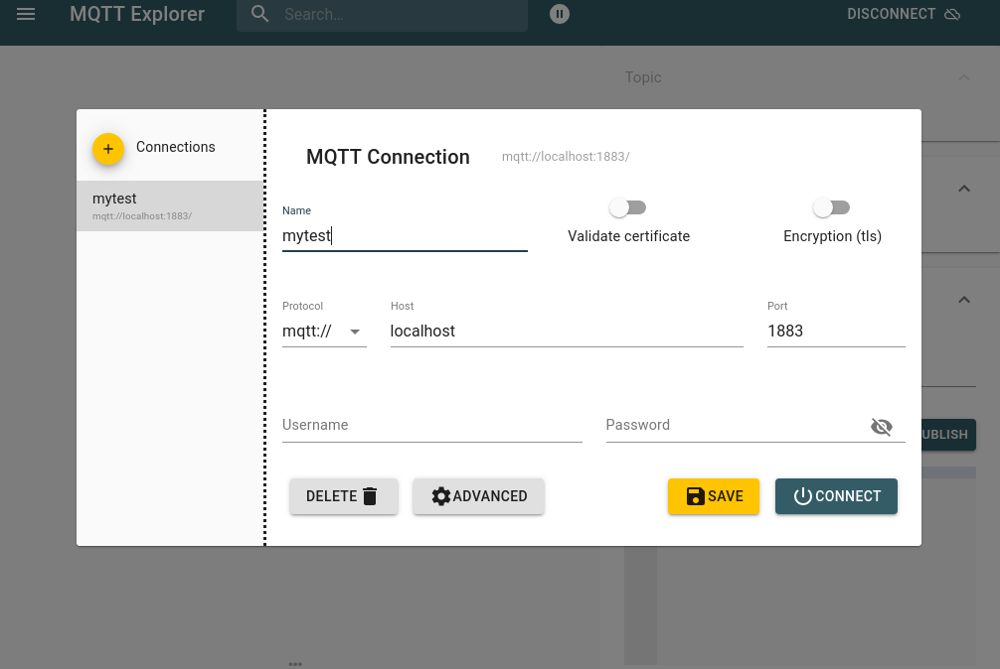
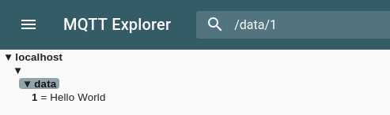
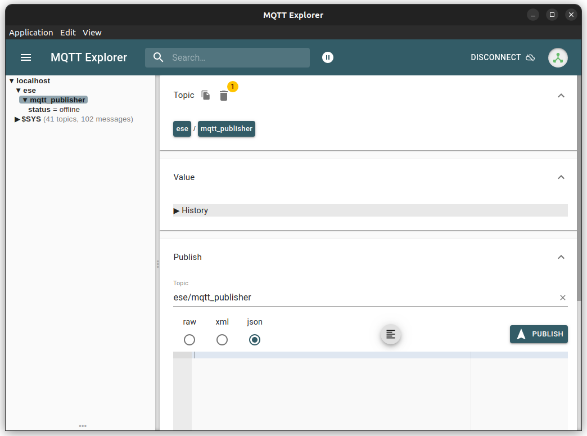
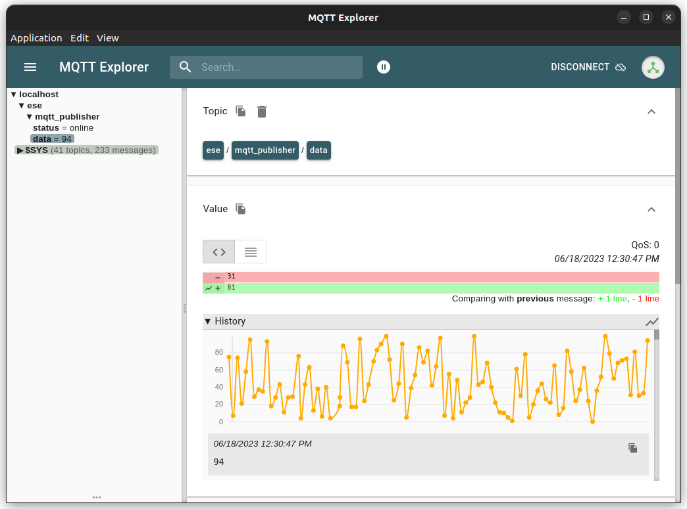

# MQTT C++ examples folder

## Notes

### MQTT in devcontainer

In the devcontainer a MQTT broker is started (in a separate docker container).
The config is saved in [.devcontainer/.mosquitto](./.devcontainer/.mosquitto).
In the "main" devcontainer ('workspace' in [docker-compose.yml](.devcontainer/docker-compose.yml)) has some built-in MQTT client tools installed:

Start in one shell:
```bash
  mosquitto_sub -h broker -t data/1
```

An in another:
```bash
mosquitto_pub -h broker -t data/1 -m "Hello"
```

Then, the first shell will display "Hello"... (the data "Hello" is published into "/data/1")

See: [more information](./cpp-library/examples/mqtt/README.md).

### Documentation

* MQTT Background: [MQTT Essentials (good introduction to MQTT from the makes of the HiveMQ MQTT broker implementation)](https://youtube.com/playlist?list=PLRkdoPznE1EMXLW6XoYLGd4uUaB6wB0wd).
* Paho: 
  * [Paho MQTT client](https://wiki.eclipse.org/Paho) library (available as ubuntu package)
  * example: https://github.com/eclipse/paho.mqtt.cpp/blob/master/src/samples/async_publish.cpp
  * https://github.com/aschiffler/cpp-mqtt

### Tools

* You can also call these mosquitto-client tool commands from outside the devcontainer (in your linux system) - the ports are exposed.
* You can also [`snap install mqtt-explorer`](http://mqtt-explorer.com/) and start the MQTT Explorer:
  * 
  * 

### More notes

* Topics should not start with a "/" ("never use a leading slash" in https://www.youtube.com/watch?v=juq_l70Vg1w&list=PLRkdoPznE1EMXLW6XoYLGd4uUaB6wB0wd&index=6).

## Examples

### mqtt_publisher

[mqtt_publisher](./mqtt_publisher.cpp)

* handles a persistent "status": "onine"/"offline" (you can check if the app is active or not, once it was running the status persists and is conrolled by the "last will" of the app).
* sends random values (10/sec) if "online".



